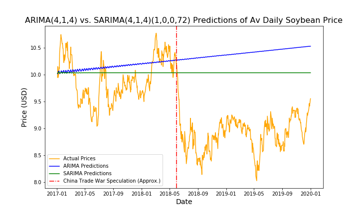

# Capstone - IN PROGRESS
  
#### Author: Andrea Yoss: [LinkedIn](https://www.linkedin.com/in/andreayoss/)

## Table of Contents

- [Problem Statement](#Problem-Statement)
- [Executive Summary](#Executive-Summary)
- [Datasets](#Datasets)
- [Modeling](#Modeling)
- [Analysis](#Analysis)
    - [Model Evaluation](#Model-Evaluation)
    - [Limitations](#Limitations)
- [Conclusion and Recommendations](#Conclusion-and-Recommendations)
- [Data Sources](#Data-Sources)
- [References](#References)

## Problem Statement

A commodity is essentially a raw material or agricultural product that can be bought and sold.  Individual commodities are regarded as indistinguishable from other units of the same type, and can be bought and sold on commodities markets using futures.  A futures contract is  an agreement between a buyer and a seller committing the buyer to purchasing a specific quanity of a commodity from the seller sometime in the future at a set price. 

Similar to investing in individual stocks, investors choose to enter into futures contracts when they believe they can profit from the agreement.  Specifically, they often invest in futures if they believe the actually price of the underlying commodity will differ at the time of expiration from the price agreed on in the contract, and so they expect to profit from this difference.  

Unfortunately, commodities prices are notoriously volatile.  Since these are based not only on prior prices and related supply/ demand factors, but also on a varity of macroeconomic factors, long-term prices are difficult to forecast.

In this project, I am focusing on soybeans, and builting an unsupervised learning model that predicts future prices of this commodity.

Since the price of soybeans today are highly correlated with prior prices (i.e., lagged values of itself), I plan to conduct time series analysis on soybean prices. Further, I will identify features that have historically contributed to the volatility of soybean prices, and evaluate their predictive capabilities using the mean absolute error (MAE) as my performance metric. I will ultimately choose the model and features with the smallest MAE.  My primary stakeholders are investors in the futures market who wish to evaluate the favorability of a soybean futures contract. 
  
----

## Executive Summary

I started off by conducting time series analysis on the 'Settlement Price,' or the average daily price, of soybeans from January 1, 1990 through December 31, 2019.

One assumption to using the Autoregressive Integrated Moving Average (ARIMA) model is that my data are stationary (no systematic changes over time).  To ensure my data met this assumption, I ran an Augmented Dickey Fuller test using $\alpha = 0.05$ on my data.  I set up the null and alternative hypotheses of this test as follows:
    
$$
\begin{eqnarray}
&H_0:& \text{not stationary} \\
&H_A:& \text{stationary}
\end{eqnarray}
$$
  
Since my $p$ -value > $\alpha$ when I used my original data, I did not have enough evidence to reject the null hypothesis, and so needed to check for stationarity in the differenced data. When I conducted the hypothesis test on the first-order differenced data, my $p$-value << $\alpha$, and so had enough evidence to reject the null hypothesis, and therefore, accept the alternative hypothesis that the first-order differenced data are stationary. 

I was then able to fit my data using an ARIMA model. 

Then, I incorporated seasonality in a SARIMA model.

Finally, I looked at introducing additional external, exogenous features in a SARIMAX model.  Some features I evaluated were: daily weather data from top US soybean producing states and seasonal US production data.  

I found that the model that did the best was my X MODEL.

----

## Datasets

|Name|Description|
|---|---|
|[S00-USA-csv.csv](/Data/S00-USA-csv.csv)| Daily Soybean commodity prices from 1/1/1990- 2/18/2020 exported from Bloomberg Terminal.|
|[NOAA_Iowa.csv](/Data/NOAA_Iowa.csv)| Daily Iowa weather data from 1/1/1990-12/31/2019 exported from the National Centers for Environmental Information (NOAA).|
|[NOAA_MN_IL.csv](/Data/NOAA_MN_IL.csv)| Daily Minnesota and Illinois weather data from 1/1/1990-12/31/2019 exported from the National Centers for Environmental Information (NOAA).|
|[USDA_Soybeans_Production.csv](/Data/USDA_Soybeans_Production.csv)| Annual US soybean production data from the United States Department of Agriculture (USDA) from 1990-2019. This dataset includes seasonal soybean approximations for: acres harvested, acres planted, and yields.|  

----

## Data Dictionaries

----

## Modeling

I built and analyzed the following time series models:
  

1. Autoregressive Integrated Moving Average model (ARIMA)
2. Facebook Prophet model
3. Seasonal Autoregressive Integrated Moving Average model (SARIMA)
4. Seasonal Autoregressive Integrated Moving Average with eXogenous regressors (SARIMAX)

----

## Analysis

### Model Evaluation

#### Table 1: Time Series Model Comparison

|Model|Mean Absolute Error|
|---|---|
|ARIMA(4,1,4)| MAE|
|SARIMA(4,1,4)(1,0,72)| MAE|
|FB Prophet| MAE|
|SARIMAX(4,1,4)|MAE|

### Limitations

**Sudden shocks based on market sentiment, and not necessarily any quantifiable features.** 
  
While I tried to account for these sudden shocks by incorporating a moving average component in my model, this only smoothed out the affects of the shocks; it does not predict them. 

I considered using natural language processing (NLP) to conduct sentiment analysis on news sources to determine likely changes in the direction of the price of soybeans. However, I decided not to include this component in my model, as any determination from this method would not only be extremely subjective, but would also quickly be reflected in the market price. With that said, an area where this could be affective would be in determining the validity of market sentiment - to determine whether or not the investor speculation that resulted in the price change is confirmed by news sentiment, for example.
  
  
**Time was a significant limitation.**
  
There are many macroeconomic factors that likely contribute to the price of soybeans; however, due to the time constraint of this project, I had to limit the number of features I analyzed.  

While the US is the largest global supplier of soybeans, Argentina and Brazil are also producers.  If I had more time to complete this project, I would've increased the scope of my project to look at global supply as a whole, not just the United States.  
  
Additionally, the strength of the United States Dollar relative to the Argentine Peso or the Brazilian Real inversely influences the price of soybeans. As the value of the US Dollar increases, the price of commododities like soybeans increase for a purchasing country based on the resultant change in the exchange rate between that country's currency and the US Dollar. Therefore, purchasing countries may choose to buy from alternative producing countries with a weaker currency, and as a result, the value of the commodity decreases as US producers are left with a greater supply vs. global demand.

----

## Conclusion and Recommendations

----

## Data Sources

Bloomberg L.P. (2020) *[Historical Pricing Data for Soybeans(CBT $/bu) Continuous(S00-USA) from 1/1/1990 to 2/18/2020, CBOTCommodity.](https://github.com/AndreaYoss/Capstone/blob/master/Data/S00-USA-csv.csv)* Retrieved from Bloomberg database. (Accessed: 19 February 2020).

----

## References

